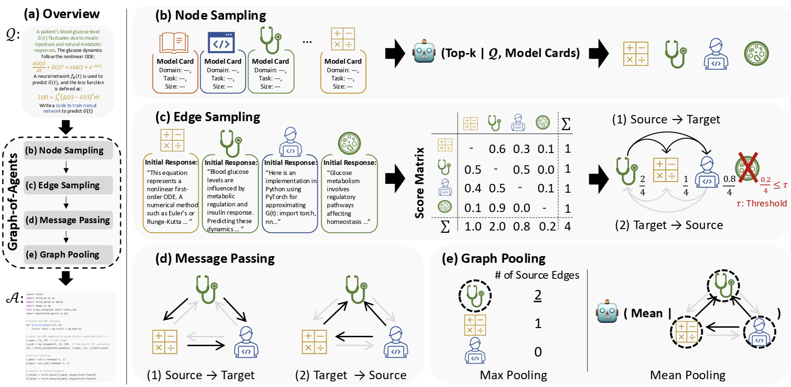

 # Graph-of-Agents: A Graph-based Framework for Multi-Agent LLM Collaboration

[](https://opensource.org/licenses/MIT) [](https://neurips.cc/)

Official implementation for "Graph-of-Agents: A Graph-based Framework for Multi-Agent LLM Collaboration" accepted by ICLR 2026.  

- Authors: [Sukwon Yun](https://sukwonyun.github.io/), [Jie Peng](https://scholar.google.com/citations?user=wD7PQt0AAAAJ&hl=EN), [Pingzhi Li](https://pingzhili.github.io/), [Wendong Fan](https://openreview.net/profile?id=~Wendong_Fan1), [Jie Chen](https://jiechenjiechen.github.io/), [James Zou](https://www.james-zou.com/), [Guohao Li](https://ghli.org/), and [Tianlong Chen](https://tianlong-chen.github.io/)


## Graph-of-Agents (GoA) Overview
A test-time inference framework that dynamically selects, evaluates, and orchestrates multiple specialized language models as a collaborative graph to solve diverse tasks.




## 1. Environment Setup

```bash
conda create -n goa python=3.10 -y
conda activate goa
pip install -r requirements.txt
```

## 2. Serving Models with vLLM

Each model runs as a separate vLLM server on its own GPU. Launch each in a separate terminal (or use `screen`/`tmux`). We recommend serving each model on a different GPU to handle calls efficiently during multiprocessing (we used 6 × A6000 GPUs for experiments with an agent pool of six models):

```bash
CUDA_VISIBLE_DEVICES=0 vllm serve Qwen/Qwen2.5-7B-Instruct --port 8000
CUDA_VISIBLE_DEVICES=1 vllm serve Qwen/Qwen2.5-Coder-7B-Instruct --port 8001
CUDA_VISIBLE_DEVICES=2 vllm serve mistralai/Mathstral-7B-v0.1 --port 8002
CUDA_VISIBLE_DEVICES=3 vllm serve ContactDoctor/Bio-Medical-Llama-3-8B --port 8003
CUDA_VISIBLE_DEVICES=4 vllm serve instruction-pretrain/finance-Llama3-8B --port 8004
CUDA_VISIBLE_DEVICES=5 vllm serve Equall/Saul-7B-Instruct-v1 --port 8005
```

Verify a server is running:

```bash
curl http://localhost:8000/v1/models
```

The model endpoints are configured in `endpoint.py`. Update the URLs and ports there if your setup differs.

## 3. Running GoA

**Dev run** (small sample for quick testing):

```bash
python main.py \
    --data MMLU_sampled \
    --eval dev \
    --reference_models qwen,qwen_coder,mathstral,biomedical_llama,finance_llama,saul \
    --meta_llm qwen \
    --graph_pooling_method mean \
    --top_k 3 \
    --seed 0
```

**Full evaluation:**

```bash
python main.py \
    --data MMLU_sampled \
    --eval test \
    --reference_models qwen,qwen_coder,mathstral,biomedical_llama,finance_llama,saul \
    --meta_llm qwen \
    --graph_pooling_method mean \
    --top_k 3 \
    --seed 0
```

**Arguments:**

| Argument | Description | Default |
|---|---|---|
| `--data` | Dataset: `GPQA`, `MMLU`, `MMLU_Pro`, `MATH`, `AIME24`, `MedMCQA`, `human_eval` | `GPQA` |
| `--eval` | `dev` (small sample) or `test` (full evaluation) | `test` |
| `--reference_models` | Comma-separated model keys from `endpoint.py` | `qwen,qwen_coder,...` |
| `--meta_llm` | General-purpose model used for node sampling and graph pooling | `qwen` |
| `--graph_pooling_method` | `max`, or `mean`| `mean` |
| `--top_k` | Number of models to select per question | `3` |
| `--threshold` | Minimum edge score to keep a model in the graph | `0.05` |
| `--rounds` | Number of message-passing rounds | `1` |
| `--temperature` | Sampling temperature | `0.7` |
| `--max_tokens` | Max tokens per generation | `800` |
| `--num_proc` | Number of parallel workers | `1` |
| `--seed` | Random seed | `0` |

Results are saved to `outputs/{data}/{eval}/`.

## 4. Adding New Model

### Step 1: Generate a model card

Use `generate_model_card.py` to automatically extract model information from HuggingFace:

```bash
python generate_model_card.py \
    --model_id "meta-llama/Meta-Llama-3-8B-Instruct" \
    --name "llama3" \
    --url "http://localhost:8006/v1/completions" \
    --domain "general" \
    --llm_model "Qwen/Qwen2.5-7B-Instruct" \
    --llm_endpoint "http://localhost:8000/v1/completions"
```

This prints a ready-to-paste dictionary entry.

### Step 2: Add to endpoint.py

Copy the generated entry into `endpoint.py`:

```python
model_endpoint_dict = {
    # ... existing models ...

    "llama3": {
        "url": "http://localhost:8006/v1/completions",
        "model_id": "meta-llama/Meta-Llama-3-8B-Instruct",
        "max_tokens": 4096,
        "domain": "general",
        "model_card": "- **Domain**: General-purpose\n- **Task Specialization**: ..."
    }
}
```

### Step 3: Serve and run

```bash
# Serve the new model
CUDA_VISIBLE_DEVICES=6 vllm serve meta-llama/Meta-Llama-3-8B-Instruct --port 8006

# Include it in the agent pool
python main.py \
    --data GPQA \
    --eval test \
    --reference_models qwen,qwen_coder,mathstral,biomedical_llama,finance_llama,saul,llama3 \
    --top_k 3
```

## Project Structure

```
GoA/
├── main.py                  # Clean evaluation script
├── modules.py               # Core GoA pipeline (prompts + graph operations)
├── utils.py                 # Utilities (LLM calls, parsing, evaluation)
├── endpoint.py              # Model endpoint configurations
├── generate_model_card.py   # Tool to generate model cards for new models
├── run.sh                   # Example run script
├── requirements.txt         # Python dependencies
└── data/
    ├── dev/                 # Small dev samples for testing
    └── test/                # Full test sets
```
